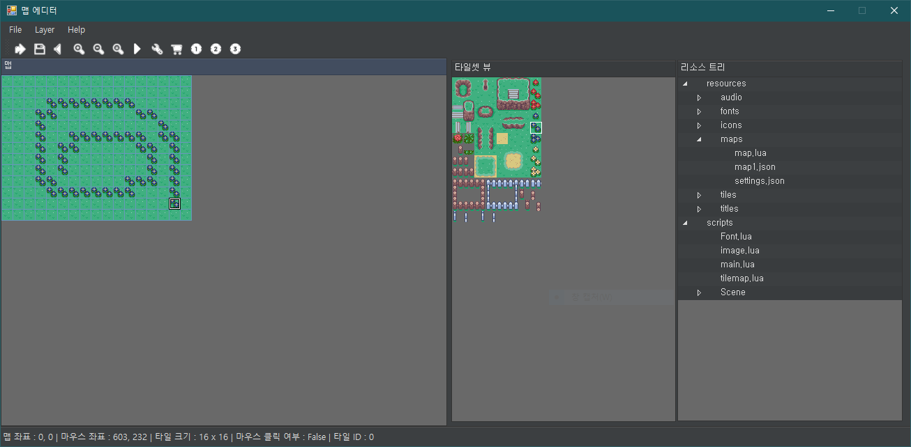

# 소개

This tool allows you to fill tiles using tile editor in the Initial2D and start the test game and edit a lua script using an internel script editor.

    

# Resource License

Kenney's Game Icons (CC0) - https://opengameart.org/content/game-icons

Ace Script Editor - https://github.com/ajaxorg/ace/blob/master/LICENSE
